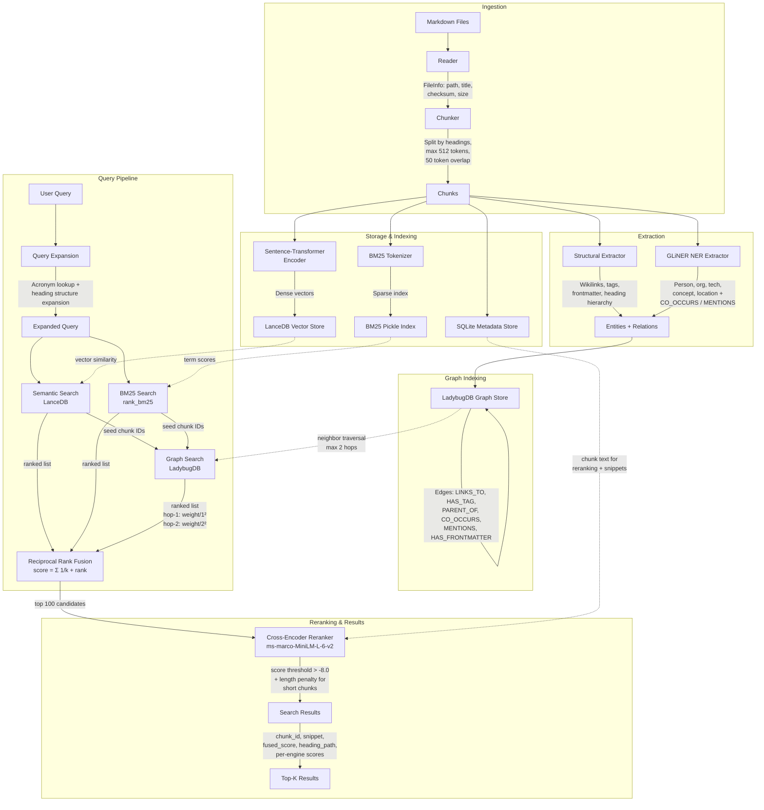

# dotMD Architecture

## Pipeline Flowchart

## Pipeline Stages

### 1. Ingestion

- **Reader** discovers `.md` files recursively, extracts title from first H1 or filename
- **Chunker** splits by ATX headings, tracks heading hierarchy, applies sentence-level sliding window for sections exceeding 512 tokens (50 token overlap)
- Chunk IDs are deterministic: `MD5(file_path:chunk_index)`

### 2. Storage & Indexing

| Store | Technology | Contents |
|-------|-----------|----------|
| SQLite | `~/.dotmd/metadata.db` | Chunk text, heading hierarchy, file path, offsets |
| LanceDB | `~/.dotmd/lancedb/` | Dense vectors from `all-MiniLM-L6-v2` |
| BM25 | `~/.dotmd/bm25_index.pkl` | Tokenized corpus for keyword scoring |

### 3. Extraction

- **Structural** (always on): wikilinks, tags, YAML frontmatter, markdown links, heading parent-child relations
- **NER** (optional, `--extract-depth ner`): GLiNER zero-shot extraction for person, organization, technology, concept, location entities plus co-occurrence and mention relations

### 4. Graph Indexing

LadybugDB stores a property graph with four node types (File, Section, Entity, Tag) and seven edge types (FILE_SECTION, SECTION_SECTION, SECTION_ENTITY, SECTION_TAG, ENTITY_ENTITY, FILE_TAG, FILE_ENTITY).

### 5. Query Pipeline

1. **Query Expansion** — acronym dictionary lookup (exact + fuzzy) and heading-structure expansion for domain terms
2. **Three parallel engines:**
   - Semantic search (dense vector similarity via LanceDB)
   - BM25 keyword search (sparse term matching)
   - Graph search (1-2 hop neighbor traversal seeded by semantic + BM25 hits)
3. **Reciprocal Rank Fusion** — `score = Σ 1/(k + rank)` with `k=60`, no learned weights needed

### 6. Reranking

- Cross-encoder (`ms-marco-MiniLM-L-6-v2`) rescores top 100 candidates
- Length penalty applied to chunks under 100 characters: `factor = 0.5 + 0.5 × (len/100)`
- Score threshold filter at `-8.0`
- Final top-K returned with per-engine scores, snippets, and heading paths